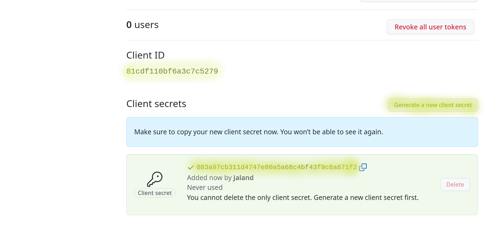

# Red Hat Developer Hub (Early Access Program) Setup instructions

> :exclamation: NOTE: *the following instructions outlined here are not intended for building a production-ready environment! It is intended to build a PoC leveraging Red Hat Openshift DevSecOps offerings.* 

## Openshift Cluster Checklist

1. Sandbox **non-production** cluster
2. minimum cluster size recommended _for a PoC_:
 * 3x Control Plane nodes with 
   * 16 vCPUs
   * 64Gb RAM
 * 3x Worker nodes with
   * 32 vCPUs
   * 128Gb RAM
3. Container Registry
 * Red Hat Quay `<-- recommended`
   * ❗**Requires an S3 compatible backend storage class configured in the cluster**
   * eg: Red Hat ODF
 * Openshift Internal Container Registry
> :white_check_mark: NOTE: RHDH includes support for these two options OOB

## Openshift DevSecOps Layered components 

> NOTE: the components listed below _may be required_ to enable some of the capabilities available in the Developer Hub instance.
> They are not required to install DevHub, but when available, they enable additional capabilities in the product.

 * Openshift GitOps (ArgoCD) `required for CD`
 * Openshift Pipelines (Tekton) `option for CI`
 * Openshift DevSpaces `Containerized Developer Workspaces (web-based VSCode IDE)`
 * Openshift Advanced Cluster Management (ACM) `required for clusters/topology view`
 * Openshift Advanced Cluster Security (ACS) `required for image security/vulnerability scanning`
 * Red Hat SSO (Keycloak) `required as an iDP broker using OIDC standard`

   > All of the components listed above are installed using Operators available in the Openshift Operator Hub

## External 3rd party Integrations
* Source Control System
 * (Enterprise/hosted) GitHub `requires additional setup`
 * (Enterprise/hosted) Gitlab `requires additional setup`
* Continuous Integration
 * Github Actions
 * Gitlab CI
* Identity Provider
 * ❗**Requires OIDC support**
 *  Red Hat SSO (based on Keycloak) is recommended as an Access Manager and iDP broker

---

# Source Control System and Identity Provider setup
> ❗This is the most important integration required by Developer Hub!

## Openshift Cluster Info

Log in to your OpenShift cluster via the `oc` client.  Set the `OPENSHIFT_CLUSTER_INFO` variable for use later.

``` sh
export OPENSHIFT_CLUSTER_INFO=$(oc cluster-info | head -n 1 | sed 's/^.*https...api//' | sed 's/.6443.*$//' )
```

>❗ tip "Using Linux?"
  If you are using a `Linux` environment, set the alias for the following commands to work:

  ```sh
  alias open="xdg-open"
  ```

For the remaining environment variables, it may be preferable create a `./env.sh` containeing the listed env vars as you complete the setup configuration, then run `source ./env.sh`.

## Create GitHub Organization (if not exist)

Create a new [Github Organization](https://github.com/account/organizations/new?plan=free). This organization will contain the code repositories for the `components` created by Red Hat Developer Hub.

The `GITHUB_ORGANIZATION` environment variable will be set to the name of the organization.

!!! tip
    You may also use any organization you are a member of, as long as you have the ability to create new repositories within it.

``` sh
export GITHUB_ORGANIZATION=
```

## Set Up GitHub Application

1. Create a new GitHub Application to use the `Git WebHooks` functionality in this demo.  The required field will be populated, and correct permissions set.

    ``` sh
    open "https://github.com/organizations/$GITHUB_ORGANIZATION/settings/apps/new?name=$GITHUB_ORGANIZATION-webhook&url=https://janus-idp.io/blog&webhook_active=false&public=false&administration=write&checks=write&actions=write&contents=write&statuses=write&vulnerability_alerts=write&dependabot_secrets=write&deployments=write&discussions=write&environments=write&issues=write&packages=write&pages=write&pull_requests=write&repository_hooks=write&repository_projects=write&secret_scanning_alerts=write&secrets=write&security_events=write&workflows=write&webhooks=write"
    ```

2. Set the `GITHUB_APP_ID` and `GITHUB_APP_CLIENT_ID` environment variables to the App ID  and App Client ID, respectively. Generate a new client secret and set the `GITHUB_APP_CLIENT_SECRET` environment variable.  Then, generate a `Private Key` for this app and **download** the private key file.  Set the `GITHUB_KEY_FILE` environment variable to the downloaded file, using either the absolute path or the path relative to the `ansible/cluster-setup` directory.
    ``` sh
    export GITHUB_APP_ID=
    export GITHUB_APP_CLIENT_ID=
    export GITHUB_APP_CLIENT_SECRET=
    export GITHUB_KEY_FILE=
    ```

    

3. Go to the `Install App` table on the left side of the page and install the GitHub App that you created for your organization.

    

## Create Github **OAuth** Applications

In this section we'll create and setup **three different** GitHub Applications that will be later integrated with our components.

### Identity Provider
Create an GitHub OAuth application in order to use GitHub as an Identity Provider for Red Hat Developer Hub.

``` sh
open "https://github.com/settings/applications/new?oauth_application[name]=$GITHUB_ORGANIZATION-identity-provider&oauth_application[url]=https://rhdh.apps$OPENSHIFT_CLUSTER_INFO&oauth_application[callback_url]=https://keycloak-backstage.apps$OPENSHIFT_CLUSTER_INFO/auth/realms/backstage/broker/github/endpoint"
```

Set the `GITHUB_KEYCLOAK_CLIENT_ID` and `GITHUB_KEYCLOAK_CLIENT_SECRET` environment variables with the values from the OAuth application.

``` sh
export GITHUB_KEYCLOAK_CLIENT_ID=
export GITHUB_KEYCLOAK_CLIENT_SECRET=
```



### DevSpaces
Create a **second** GitHub OAuth application to enable Dev Spaces to seamlessly push code changes to the repository for new components created in Red Hat Developer Hub.  

``` sh
open "https://github.com/settings/applications/new?oauth_application[name]=$GITHUB_ORGANIZATION-dev-spaces&oauth_application[url]=https://devspaces.apps$OPENSHIFT_CLUSTER_INFO&oauth_application[callback_url]=https://devspaces.apps$OPENSHIFT_CLUSTER_INFO/api/oauth/callback"
```

Set the `GITHUB_DEV_SPACES_CLIENT_ID` and `GITHUB_DEV_SPACES_CLIENT_SECRET` environment variables with the values from the OAuth application.

``` sh
export GITHUB_DEV_SPACES_CLIENT_ID=
export GITHUB_DEV_SPACES_CLIENT_SECRET=
```

### Developer Hub plugins
Create a **third** GitHub OAuth application to enable the numerous Red Hat Developer Hub plugins utilizing GitHub to authenticate and access the relevant data.

``` sh
open "https://github.com/settings/applications/new?oauth_application[name]=$GITHUB_ORGANIZATION-backstage&oauth_application[url]=https://rhdh.apps$OPENSHIFT_CLUSTER_INFO&oauth_application[callback_url]=https://rhdh.apps$OPENSHIFT_CLUSTER_INFO/api/auth/github/handler/frame"
```

Set the `GITHUB_BACKSTAGE_CLIENT_ID` and `GITHUB_BACKSTAGE_CLIENT_SECRET` environment variables with the values from the OAuth application.

``` sh
export GITHUB_BACKSTAGE_CLIENT_ID=
export GITHUB_BACKSTAGE_CLIENT_SECRET=
```

---

# Red Hat Developer Hub
## Installation

## Initial configuration

### Main Config Secret
### Main Config Map

## Onboarding a Sample Application Entity

## Creating a sample Golden Path Template
